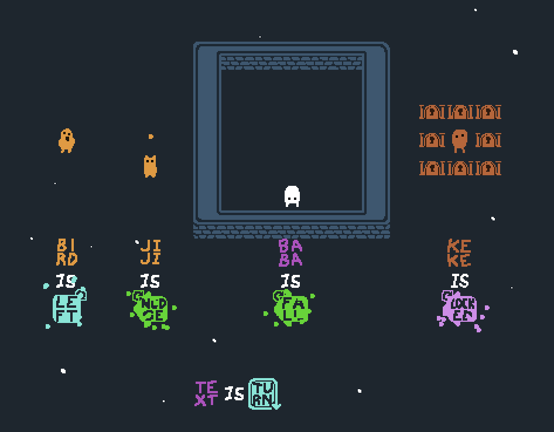

# Baba Is You - Turning Text Mod

A Baba Is You mod that adds variants of nudge, fall, locked and directional properties that change their meaning based on their facing direction.

Best if you look at some gifs for a full explaination:

# Installation

- Requires Steam version on beta version 390 (future beta versions may or may not work depending on how much the base code is changed)

To install, copy both Lua and Sprites folder into the levelpack you want to include the mod. Make sure the world_data.txt in the levelpack folder has `mods=1` set underneath the `[General]` section.

The new text blocks can be found in the level editor at the end of the list or if you search "turning_dir", "turning_nudge", "turning_fall" or "turning_locked".

**FOR MODDERS/LEVELPACK MAKERS**: if you want to include this mod with other mods, I've overriden a few of the main game functions but made sure to minimalize my changes so that you can easily place it in your versions of the overrided functions.
The lines surrounded by `--@ Turning Text` are my changes, while turning_text_functions.lua provides the main functionality and contains no overrides. However, *there is no guarantee that this mod will work nicely with other mods*.

Please credit me if you do use use this mod in a levelpack or include this with other mods :)